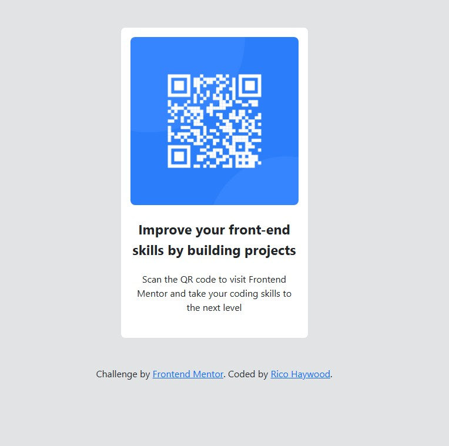

# Frontend Mentor - QR code component solution

This is a solution to the [QR code component challenge on Frontend Mentor](https://www.frontendmentor.io/challenges/qr-code-component-iux_sIO_H). Frontend Mentor challenges help you improve your coding skills by building realistic projects. 

## Table of contents

- [Overview](#overview)
  - [Screenshot](#screenshot)
- [My process](#my-process)
  - [Built with](#built-with)
  - [What I learned](#what-i-learned)
  - [Continued development](#continued-development)
  - [Useful resources](#useful-resources)

## Overview

### Screenshot



## My process

### Built with

- Semantic HTML5 markup
- Bootstrap
- Flexbox

### What I learned

Use this section to recap over some of your major learnings while working through this project. Writing these out and providing code samples of areas you want to highlight is a great way to reinforce your own knowledge.

To see how you can add code snippets, see below:

```html
<section
      class="card mt-5 pt-3 px-3 pb-4 border border-success-4 rounded-3"
      style="width: 20rem"
    >
      
      <div class="d-flex flex-column align-items-center px-1 gap-1 mt-4">
        <p class="fs-4 fw-bold text-center">
          Improve your front-end skills by building projects
        </p>
        <p class="fs-6 fw-normal text-center">
          Scan the QR code to visit Frontend Mentor and take your coding skills
          to the next level
        </p>
      </div>
</section>
```

### Continued development

I learned how to utilize figma to develop wireframes and utilize the developer tools to understand and structure the html and css code.
I need to do continued research to understand how/when to use flex elements vs grid elements; and how to implement media queries to adapt to screen sizes.
I need to develop a better undestanding on the use of media queries and how to implement them when using bootstrap.

### Useful resources

- [Bootstrap-Bcakground](https://getbootstrap.com/docs/5.3/utilities/background/) - While in an indirect relation to the challenge, this tutrial helped me to gain a deeper understanding of Frames, Components, and Prototyping in figma.

